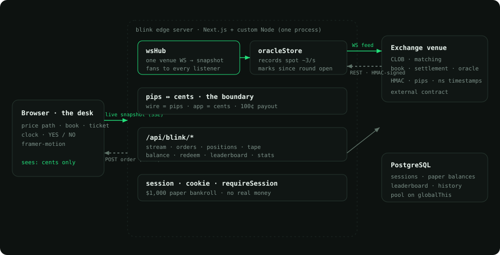
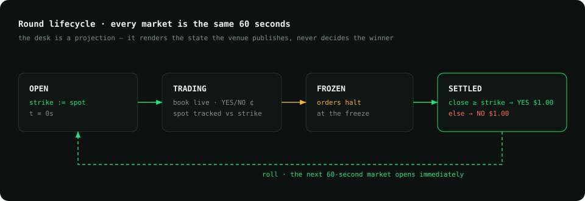
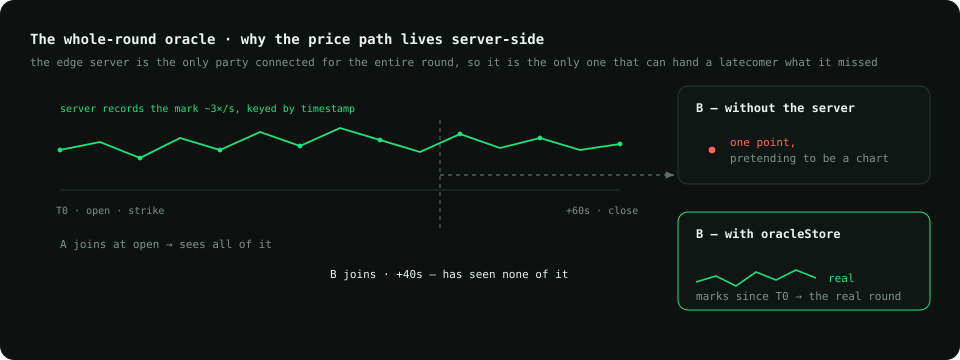
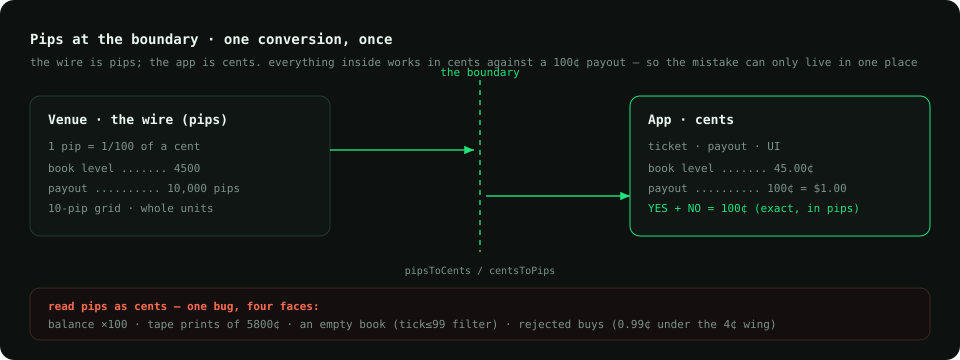

# blink.markets — a 60-second event desk

Architecture for **blink.markets**, a trading desk for a high-frequency binary
event exchange. A fresh **BTC 60-second market** opens every minute — *higher
or lower than where it opened?* — a side costs a few cents and settles at
**$1.00**, so the cheaper you were right, the more you made. Then it happens
again. Next.js + a custom Node server, deployed on Fly, live at
[blinkmarkets.xyz](https://blinkmarkets.xyz). Paper-credits testnet — $1,000
bankroll, no wallet, no real money.

The exchange underneath is a raw venue that speaks in **pips** and 19-digit
nanosecond timestamps, authenticated with an HMAC signature on every request.
The desk's entire job is to make that feel like a game you can read in one
glance — a live price path, two prices that add to a dollar, a clock — without
ever lying about the round.

> **The desk is not the exchange.** It holds one authenticated connection to
> the venue, owns the whole round's history so no client has to reconstruct it,
> and normalizes the venue's units at a single boundary — so the browser only
> ever sees cents, a clean price path, and the side that is currently ahead.

— **Yashvardhan Gaur** · [github.com/gauryvg98](https://github.com/gauryvg98)

---

## What makes it interesting

- **One connection, fanned to everyone.** A single hub holds the authenticated
  WebSocket to the venue and assembles a `HubSnapshot` — round, both order
  books, the trade tape, the oracle path, balance — that every browser
  subscribes to. A thousand viewers cost one upstream connection, not a
  thousand; a browser that reconnects gets the current snapshot immediately,
  not a cold start.
- **The server owns the whole round.** A client that joins at *t + 40s* has
  seen none of the round, so its sparkline would be a single point pretending
  to be a chart. The edge server has been recording the oracle mark ~3×/second
  the whole time, keyed by timestamp, and hands over *the marks since this
  round opened*. The chart is real for the latecomer, not faked from one tick.
- **Pips confined to the boundary.** The venue prices in pips — a hundredth of
  a cent, so a contract pays 10,000 pips and a book level arrives as `4500`.
  Reading pips as cents is one mistake with four faces (a balance inflated
  100×, tape prints of 5800¢, an empty book, rejected buys). Conversion happens
  once, at the API edge; the UI, the ticket maths and the payout arithmetic all
  keep working in cents against a 100¢ payout.
- **Complementary pricing is exact.** YES and NO always add to $1.00, but cents
  are floats and a 95.7¢ bid mirrors to `4.299999999999997¢`. The complement
  and the spread are taken in *pips* — whole units on a 10-pip grid — so the
  subtraction is exact and the single divide that follows lands on 4.3.
- **The secret never reaches the browser.** Orders carry an HMAC-SHA256
  signature over `timestamp\nmethod\ntarget\nbody`. The 32-byte secret lives
  only in the server's environment; the browser posts intent to the edge, and
  the edge signs. A leaked key is a leaked account, so it never leaves the
  process that has to have it.
- **Process-global singletons on purpose.** The custom server and the Next
  route handlers are one OS process but *not* one module registry, and the dev
  server re-evaluates modules on every save. The Postgres pool and the oracle
  store live on `globalThis` so a connection pool isn't leaked on every edit and
  the routes can read the same round the server is recording.

## Diagrams

### 1. System overview
The browser talks only to the edge server, over a snapshot stream out and an
order POST in. The edge server holds the one HMAC-signed link to the venue
(REST for orders, WebSocket for the feed), records the oracle path, normalizes
pips→cents, and keeps its own sessions, paper balances and leaderboard in
Postgres. The venue owns matching, the book and settlement.

### 2. Round lifecycle
Every market is the same 60 seconds. At the open the strike is the spot; the
book trades until the freeze; at expiry the venue settles YES to $1.00 if the
close is at or above the strike, NO otherwise — then rolls straight into the
next round. The desk is a pure projection of this state; it never decides a
winner, it only renders the one the venue published.

### 3. The whole-round oracle
Why the price path is recorded server-side. Two browsers join the same round at
different times; both must see the same real chart. The edge server is the only
party connected for the entire round, so it is the only one that can hand a
latecomer the marks it missed.

### 4. Pips at the boundary
The venue's unit is the pip; the app's unit is the cent. Conversion is a single
membrane at the API edge — everything inside works in cents against a 100¢
payout, everything on the wire is whole pips on a 10-pip grid. The complement
and the spread cross the membrane in pips so the arithmetic stays exact.

---

## Conventions

- Diagrams are hand-authored SVG (dark theme) committed alongside the notes, so
  they render on GitHub and anywhere that needs a static image.
- This describes the desk/edge layer I built — the client-facing architecture.
  The matching engine, book and settlement belong to the exchange venue and are
  treated as an external contract, not documented here.

## License

[CC BY 4.0](../LICENSE) — reuse with attribution.
