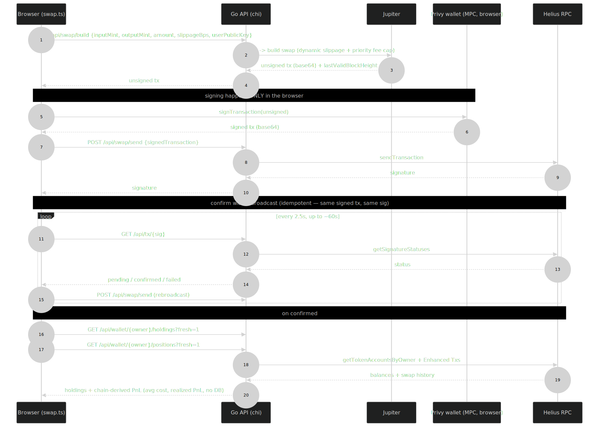

# ChadWallet — Real-Time Solana Trading App

Architecture for **ChadWallet**, a non-custodial Solana meme-coin trading app I built
end-to-end: a **Next.js 16 / React 19** frontend (Vercel) over a small **Go** API (Fly.io)
that fronts real Solana data from free / keyless sources. It executes real on-chain swaps
on mainnet.

The design has one organising idea: **the backend is cache-first and poller-driven**, and
**a single websocket hub fans one upstream fetch out to every viewer** — so upstream load
scales with the number of *tokens tracked*, not the number of *users*. Swaps are
**non-custodial**: built server-side, signed in the browser by a Privy MPC wallet,
broadcast by the server, which never holds a key.

🔗 Live: https://chad-wallet-beryl.vercel.app · — **Yashvardhan Gaur**

---

## Diagrams

### 1. System overview
Browser (Next.js, Vercel) over REST + WebSocket to a Go API (Fly), the mock↔live
`ApiClient` seam, the Privy MPC wallet, and the free upstreams.



### 2. Cache-first, poller-driven fan-out
Background pollers are the *only* path to the rate-limited upstreams; request handlers
serve warm snapshots; a circuit breaker serves last-good on failure. 1 user and 1,000
users put nearly the same load on upstreams.



### 3. WebSocket hub + per-mint live-price store
Refcounted subscriptions (one upstream call per mint regardless of viewers), a batch
Jupiter price call per tick, and a frontend per-mint external store that re-renders only
the rows that changed — at most once per animation frame.



### 4. Non-custodial swap execution
`build` (Jupiter route, server) → `sign` (Privy MPC wallet, **browser**) → `send`
(server → Helius) → poll + idempotent rebroadcast until confirmed → refetch holdings and
chain-derived PnL.



---

## Engineering properties worth calling out

- **Upstream load decoupled from users.** Free upstreams (GeckoTerminal ~30 req/min,
  DexScreener, Jupiter lite-api) are tightly rate-limited and never touched on the request
  path. Pollers warm an in-memory TTL cache; handlers read snapshots; the websocket hub
  fans one fetch out to all viewers.
- **Stale-while-error + circuit breaker.** A per-upstream circuit breaker stops hammering a
  failing source; the cache keeps serving the last-good snapshot while it cools.
- **Render efficiency.** A per-mint external store (`useSyncExternalStore`) with
  `requestAnimationFrame` coalescing lets 50+ rows tick live without re-rendering the page;
  only components subscribed to a given mint update.
- **Non-custodial by construction.** The server has no signing authority. `/api/swap/send`
  only accepts an already-signed transaction; the Privy embedded wallet reconstructs the key
  client-side only (MPC / Shamir shares). Even the Privy app secret couldn't move funds.
- **No database.** Holdings, cost basis, and realized PnL are reconstructed from on-chain
  swap history (Helius Enhanced Transactions). The chain is the ledger.
- **Idempotent confirmation.** Confirmation re-broadcasts the same signed transaction (same
  signature) on a 2.5s loop, so a dropped tx self-heals without risk of a double-send.

## Tech

Go (chi, gorilla/websocket) · Next.js 16 / React 19 · Tailwind v4 ·
TradingView lightweight-charts · Privy (embedded MPC wallet) ·
Jupiter / Helius / DexScreener / GeckoTerminal / PumpPortal · Vercel + Fly.io

## Rendering the diagrams

Sources are [Mermaid](https://mermaid.js.org/) (`.mmd`) with `.svg` exports committed
alongside. To regenerate:

```bash
npx -p @mermaid-js/mermaid-cli mmdc -i diagrams/01-system-overview.mmd -o diagrams/01-system-overview.svg
```

## License

Diagrams and text: [CC BY 4.0](../LICENSE) — reuse with attribution.
