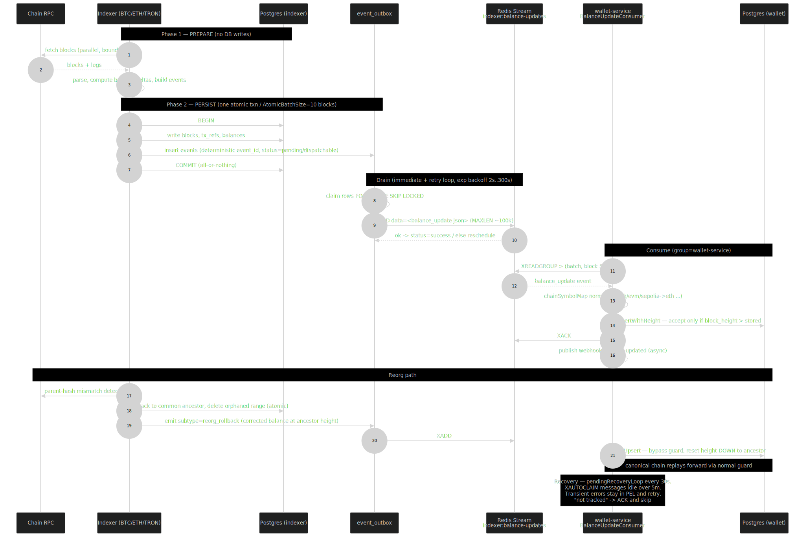

# Event-Driven Architecture for a Multi-Chain MPC Custody Platform

A reference set of architecture diagrams for a production multi-chain (BTC / ETH / TRON)
**MPC custody platform** I designed and built as a backend / blockchain engineer.

The system is event-driven on a **Redis backbone** — Redis **Streams** for durable,
outbox-backed delivery and Redis **Pub/Sub** for real-time fan-out — with **PostgreSQL**
as each service's system of record. The diagrams focus on the parts where correctness
under load actually matters: reconciling on-chain state against a system of record,
surviving chain reorgs, signing and broadcasting transactions exactly once, and
delivering events reliably to clients.

> These diagrams are anonymized and generalized to describe the engineering patterns,
> not any specific employer's proprietary internals. Service names are illustrative.

— **Yashvardhan Gaur** · [github.com/gauryvg98](https://github.com/gauryvg98)

---

## Diagrams

### 1. Event-driven backbone (system context)
How blockchain indexers, domain services, and clients connect across the two Redis
transports.



### 2. Indexer → wallet balance reconciliation
The reliability core: two-phase prepare/persist, a per-batch atomic transaction, an
event outbox drained to a Redis Stream, confirmation gating, and a reorg-safe consumer.



### 3. Custody transfer pipeline
Multi-approval governance → MPC signing → broadcast → confirmation, with a
policy-signature gate and a pre-sign transaction validator.



### 4. Outbound webhooks (Client API)
Signed, retryable delivery: producers → a `webhook_events` stream → a delivery service
that signs with **ECDSA P-256 (detached JWS)** and retries with backoff; clients verify
against a published **JWKS** endpoint.



### 5. Real-time WebSockets
A WebSocket gateway bridges Redis Pub/Sub channels (user / profile / entity scoped) to
authenticated client sockets.



---

## Engineering properties worth calling out

- **Idempotency.** Every outbox row carries a deterministic `event_id` (hash of the
  event's natural key). A unique constraint plus consumer-side dedup means retries and
  replays never double-apply.
- **Source-of-truth reconciliation.** The chain is authoritative. Indexers detect reorgs
  by parent-hash comparison, roll back to the common ancestor atomically, and emit
  `reorg_rollback` corrections that the downstream consumer applies by force-resetting its
  height watermark — after which the canonical chain replays forward through the normal
  ordering guard.
- **Atomicity.** State and the outbox are written in a single per-batch transaction
  (all-or-nothing); a mid-batch failure rolls the whole batch back, so the ledger is never
  left half-written.
- **At-least-once, ordered.** Redis Streams consumer groups (`XREADGROUP` / `XACK` /
  `XAUTOCLAIM`) with a strictly-monotonic `block_height` ordering guard. Transient failures
  stay in the pending list and recover automatically after a broker restart.
- **Confirmation gating.** Events are held `pending_confirmation` until the required depth
  is reached, then promoted; confirmed and unconfirmed balance buckets are kept separate.
- **Signed delivery.** Outbound webhooks are signed with ECDSA P-256 (detached JWS over
  `timestamp.payload`); clients verify with the public key from a JWKS endpoint.

## Tech

Go · C# · PostgreSQL · Redis (Streams + Pub/Sub) · MPC signing · gorilla/websocket ·
EVM / Bitcoin / TRON RPC

## Rendering the diagrams

Sources are [Mermaid](https://mermaid.js.org/) (`.mmd`); GitHub renders them inline, and
the committed `.svg` exports are crisp at any size. To regenerate locally:

```bash
npx -p @mermaid-js/mermaid-cli mmdc -i diagrams/01-event-driven-backbone.mmd -o diagrams/01-event-driven-backbone.svg
```

## License

Diagrams and text: [CC BY 4.0](../LICENSE) — reuse with attribution.
