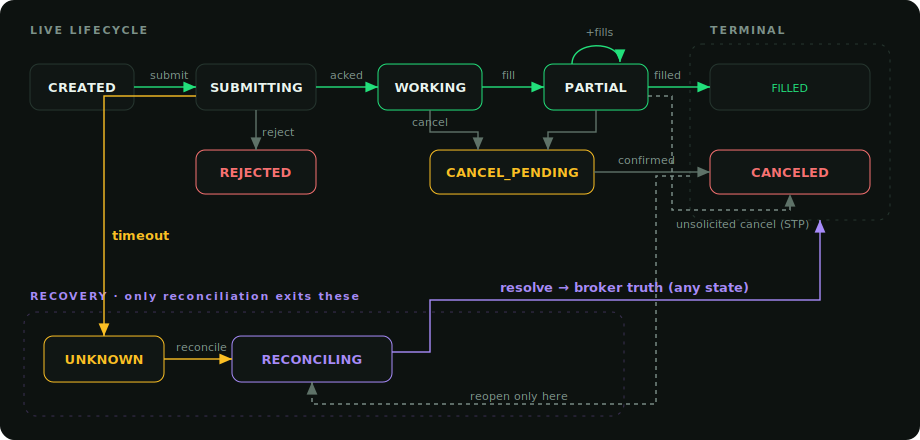
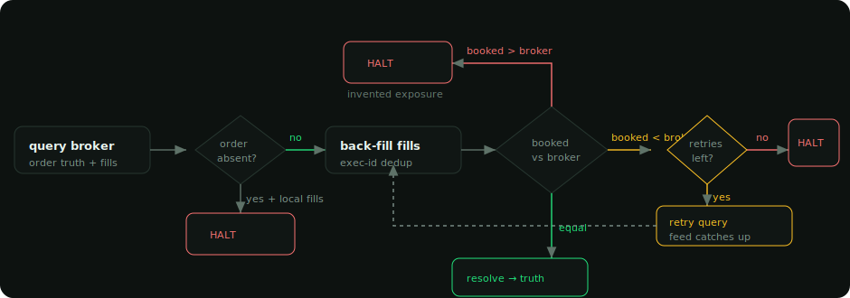

# Sentinel — Execution-Integrity-First OMS

Architecture for **Sentinel**, an order management system for automated crypto trading that
I built end-to-end: **Python 3.11 / asyncio** over **PostgreSQL**, a **FastAPI + WebSocket**
terminal, trading Binance / Bybit perpetuals. It runs a fleet of independent per-symbol bots
on one exchange account.

The design has one organising idea: **the OMS refuses to lie about your position.** It is an
**append-only event ledger** with a **pure state machine**; orders, positions and fills are
**derived projections** you can rebuild from the log at any time. When the ledger and the
exchange disagree it **reconciles against broker truth and halts on genuine disagreement** —
"halt, don't absorb." A timeout is not a rejection; an unknown is not a zero; we never invent
exposure the exchange doesn't hold.

— **Yashvardhan Gaur** · [github.com/gauryvg98](https://github.com/gauryvg98)

> **Low-level design** — DB schema, component breakdown and glossary: **[lld.md](lld.md)**.

---

## Diagrams

### 1. System overview
One account-scoped `SentinelApp` owns the durable core — the event ledger, command gateway,
reconciler, task supervisor and single-writer coordinator. An `InstrumentManager` runs a
fleet of independent bots (each: market feed, bar clock, exchange rules, strategy, order
terminal). A `Venue` abstraction hides Binance-futures / Bybit / spot. The browser talks to
it all over a single WebSocket that pushes only what changed.

### 2. Event-sourced write path
Commands pass the guards, then **append an immutable event**. State moves only through one
pure, total function — `transition(order, event) → order` — and orders / positions / fills
are folded from the log. Drop the projections and you rebuild them by replay: the log is the
source of truth.

### 3. Order state machine
The subtlety that separates a real OMS from a toy is what it does when it *doesn't know*. A
submission that times out is not rejected — its outcome is unprovable, so it parks in
`UNKNOWN` and only reconciliation may move it. A fill can race ahead of the ack; a cancel can
be confirmed by the venue that we never requested (self-trade prevention). Each is an
explicit, legal, tested edge — not an exception that crashes the loop.

### 4. Reconciliation — halt, don't absorb
On restart (and on any live divergence) the OMS rebuilds projections, back-fills missed fills
idempotently (exec-id dedup → exactly-once), then compares booked quantity to broker truth.
**Booked > broker** is invented exposure — halt at once. **Booked < broker** may be the fill
feed lagging `executedQty` mid-fill — retry a few times, then halt only if the gap survives.
A pure connectivity **timeout** means we learned nothing — retry, never halt. Only a genuine
disagreement about exposure stops the account.

### 5. Data model
An append-only log is the truth; `orders` / `positions` / `fills` are projections folded from
it and rebuildable by replay. The safety properties live in **DB constraints** — `command_id
UNIQUE` (idempotency), `exec_id` PRIMARY KEY (exactly-once exposure), `filled_qty <= qty`
(no overfill). Full per-table docs in **[lld.md](lld.md)**.

---

## Strategies

Strategies are **pure and edge-free**: each states a desired *stance* (`LONG` / `FLAT` /
`SHORT`) every bar, plus optional risk hooks in the decision `detail`. The runner reconciles
the actual position toward that target; the risk layer turns intent into size and protection.
The point of Sentinel is execution integrity, not alpha — the strategies are deliberately
classic.

| Strategy | Signal | Risk hook it emits |
|---|---|---|
| **`sma`** | Fast/slow SMA crossover — `LONG` when fast > slow, else `FLAT` (long-only) | **`stop_dist`** = distance from price to the slow SMA (the trend line; a long is wrong once price falls back to it), floored so a near-cross entry can't give a zero-width stop |
| **`sma-ls`** | Same crossover, **stop-and-reverse**: `SHORT` below the cross instead of `FLAT` (always in the market; spot clamps `SHORT` → `FLAT`) | same `stop_dist` geometry |
| **`regime`** | Regime-gated: **Donchian** breakout trend engine, armed only when **ADX** says trending; a **z-score** mean-reversion overlay (buy dips) in *range* regimes | **`target_weight`** ∈ [0,1] — **vol-targeted** conviction = risk-budget / realized-vol, a risk-normalizer (not a return predictor) |

**Two ways a strategy feeds the risk layer:**

- **`detail["stop_dist"]` — *where* the thesis breaks.** The risk layer sizes *and* enforces
  the stop-loss off the **same** distance, so position size and SL can never disagree. Absent
  (e.g. `regime`), the risk layer falls back to an ATR-based stop.
- **`detail["target_weight"]` — *how convinced*, in [0,1].** Scales the risk-sized quantity —
  `regime` uses it to shrink size as realized volatility rises.

So a strategy owns the *thesis and its stop*; the risk layer owns the *money* (size, leverage,
brackets) — `qty = risk_pct · equity_share · conviction / stop_distance`, leverage-capped.
This is the clean seam that lets the same risk machinery serve a trend follower and a
mean-reverter unchanged.

---

## Engineering properties worth calling out

- **Integrity over cleverness.** The exchange is the source of truth for *exposure*; the
  ledger for *intent and history*; any contradiction is a first-class, halt-worthy event
  rather than something to paper over. The strategy is replaceable — the integrity is the
  product.
- **The core is pure.** The domain has no I/O and no clock — the entire state machine and
  every guard are unit-tested before a broker or feed exists (315 tests). A bad strategy can
  trade badly but can never corrupt the ledger, because `transition()` is the only way state
  moves.
- **Rebuildable by construction.** Projections are a fold of the event log — drop them and
  replay. Continuously-checked invariants (`positions = fills`, `no_overfill`,
  `exits_bounded`, `audit_traced`) prove the fold stayed honest.
- **Fail toward safety, not brittleness.** Timeouts, unknown broker statuses,
  self-trade-prevention cancels and lagging fill feeds are all *legal, tested transitions* —
  each was a real production halt before it was handled. Transient (retry) is separated
  explicitly from genuine divergence (halt), so the system is neither brittle (halting on
  every network blip) nor unsafe (trading through real divergence).
- **A fleet on one account.** Tens of bots share one ledger, one user-data stream and one
  margin pool. A single-writer coordinator serialises writes per instrument; instrument rules
  (lot / tick / min-notional / settlement asset) are fetched from the venue, never hardcoded;
  and each bot sizes off its *slice* of the settlement-asset pool it actually draws on — so N
  bots can never each size against the whole account.
- **Risk tied to the stop.** Size is `risk_pct · equity_share · conviction / stop_distance`,
  leverage-capped — the *same* stop feeds both the position size and the protective stop-loss,
  so they can never disagree. A strategy can supply its own stop geometry (e.g. distance back
  to the trend line); liquidation distance is derived live from the streamed mark.
- **The browser polls nothing.** A topic-based change signal pushes one bot card, or the
  account, over a single WebSocket, with a client liveness watchdog that reconnects a
  silently-dead socket instead of freezing.

---

*Content describes engineering patterns in a personal project. Diagrams are hand-authored SVG
(committed directly), themed to match the Sentinel terminal.*
