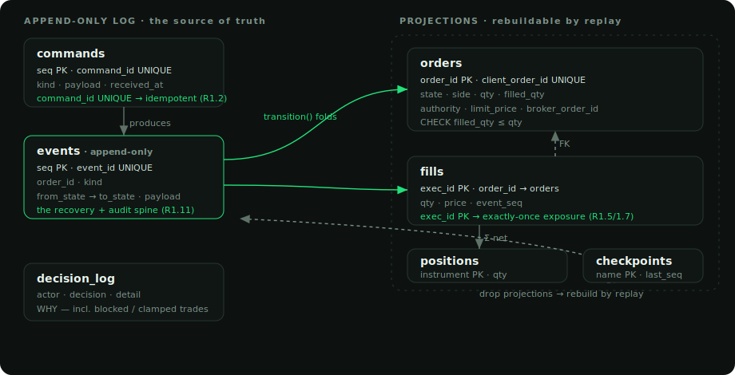

# Sentinel — Low-Level Design

Companion to the [architecture overview](README.md). This document goes down a level: the
**database schema**, the **component breakdown**, and a **glossary** of the terms the codebase
and the diagrams use.

---

## 1. Data model

Sentinel's persistence has one shape: an **append-only log is the truth**, and everything else
is a **projection** folded from it and rebuildable by replay. The safety properties live in
**database constraints**, not in careful application code — idempotency, exactly-once exposure
and audit are each enforced by a `UNIQUE` / `PRIMARY KEY` / append-only table rather than
trusted to a code path.

### Tables

Eight tables in two groups — the durable log, and the projections rebuilt from it.

#### `commands` — the intent log *(append-only)*
Every external request (place, cancel) is recorded before it is acted on.

| Column | Type | Notes |
|---|---|---|
| `seq` | BIGSERIAL PK | monotonic order of receipt |
| `command_id` | UUID **UNIQUE** | **idempotency key** — a retried command is a no-op (R1.2) |
| `trace_id` | UUID | correlates a command with the events and decisions it caused |
| `kind` | TEXT | command type |
| `payload` | JSONB | the request |
| `received_at` | TIMESTAMPTZ | |

#### `events` — the event log *(append-only, the spine)*
The single source of truth. Every state change is one row; nothing is ever updated or deleted.

| Column | Type | Notes |
|---|---|---|
| `seq` | BIGSERIAL PK | global event order — the replay sequence |
| `event_id` | UUID **UNIQUE** | dedup on ingest |
| `trace_id` | UUID | back to the causing command |
| `order_id` | UUID | which order this event concerns |
| `kind` | TEXT | `SUBMISSION_STARTED`, `BROKER_ACKED`, `FILL_APPLIED`, `RECONCILE_RESOLVED`, … |
| `from_state` / `to_state` | TEXT | the transition, for audit |
| `payload` | JSONB | event data (qty, price, exec_id, …) |
| `occurred_at` | TIMESTAMPTZ | |

Indexed `(order_id, seq)` so one order's history is a cheap range scan. **Recovery replays
this table**; the projections below are disposable.

#### `orders` — projection: current order state
Folded from `events` through the pure `transition()` function. On any disagreement with the
log, the log wins (rebuild).

| Column | Type | Notes |
|---|---|---|
| `order_id` | UUID PK | |
| `client_order_id` | TEXT **UNIQUE** | our idempotent handle to the broker — the reconciliation key |
| `instrument` | TEXT | symbol |
| `side` | TEXT | `BUY` / `SELL` (CHECK) |
| `qty` | NUMERIC | `CHECK (qty > 0)` |
| `filled_qty` | NUMERIC | `CHECK (filled_qty >= 0)` and **`CHECK (filled_qty <= qty)`** — the no-overfill invariant, enforced by the DB |
| `state` | TEXT | the state-machine value |
| `authority` | TEXT | `ENTRY` / `PROTECTIVE_EXIT` (CHECK) — protective exits get their own guard budget |
| `limit_price` | NUMERIC | resting price; NULL for market orders |
| `broker_order_id` | TEXT | the exchange's id, discovered on ack/recovery |
| `last_event_seq` | BIGINT | the event this projection reflects |

#### `fills` — the exposure ledger *(exactly-once)*
The **only** way exposure moves. One row per execution, keyed by the broker's exec-id.

| Column | Type | Notes |
|---|---|---|
| `exec_id` | TEXT **PK** | **exactly-once** — re-applying a fill is a primary-key no-op (R1.5 / R1.7) |
| `order_id` | UUID → `orders` | FK |
| `qty` / `price` | NUMERIC | the execution |
| `event_seq` | BIGINT | the `FILL_APPLIED` event that wrote it |

#### `positions` — projection: net exposure per instrument
`instrument` PK, signed `qty`, aggregated from `fills`. Continuously checked to equal
`Σ fills` (the `positions = fills` invariant).

#### `decision_log` — *why*, including the trades that didn't happen
Order events answer "what happened"; decisions answer "why" — including **blocked entries and
clamped exits**, which lifecycle events structurally can't capture.

| Column | Notes |
|---|---|
| `actor` | `gateway` \| `guards` \| `reconciler` \| `protection` \| `strategy` |
| `decision` | `ENTRY_PLACED` \| `ENTRY_BLOCKED` \| `EXIT_CLAMPED` \| … |
| `detail` | JSONB context |

#### `checkpoints` — recovery cursors
`name` PK → `last_seq`. Where each consumer/projection has caught up to in the event log.

---

## 2. Components

One account-scoped `SentinelApp` owns the durable core; an `InstrumentManager` runs the bot
fleet above it. See the [system overview](diagrams/01-system-overview.svg) for how they wire
together. Each Python package is a focused responsibility with a clean seam to the next.

| Package | Key types | Responsibility |
|---|---|---|
| `domain` | `OrderCore`, `OrderState`, `transition()`, `ALLOWED` | The pure order model + total state-machine function. **No I/O, no clock** — the whole protocol is unit-tested before a broker exists. |
| `ledger` | `LedgerStore` | Append events; fold + persist projections; serve `recent_*` reads; rebuild projections on recovery. |
| `oms` | `CommandGateway`, `OrderEngine`, guards, `WriterCoordinator` | Turn commands into events through the guards (R1.x invariants); serialise writes **single-writer per instrument**. |
| `recon` | `Reconciler` | Startup recovery + live reconciliation against broker truth — the halt / retry / resolve decisions. |
| `broker` | `BrokerAdapter`, `BinanceFuturesAdapter`, `BybitAdapter` | One interface; each exchange's REST + user-data stream normalised to domain events (`BrokerAcked`, `BrokerFill`, `BrokerTimeout`, …). |
| `strategy` | `SmaCross`, `RegimeTrendMR`, `Decision` | Pure, edge-free target-stance strategies (see [README §strategies]). |
| `risk` | `RiskParams`, `risk_sized_qty`, `brackets`, `atr` | Position sizing tied to the stop, SL/TP geometry, leverage & per-pool margin — the money layer, separate from alpha. |
| `marks` | `compute_pnl` | Mark-to-market P&L from fills + the live mark. |
| `runtime` | `SentinelApp`, `Supervisor`, `ChangeSignal` | Wires it all; supervises tasks (halt on fatal); the topic-based UI notifier. |
| `ui` | `InstrumentManager`, `Bot`, `Venue`, `StrategyRunner`, FastAPI | The bot fleet, the venue abstraction, the peg-to-touch execution runner, and the WebSocket terminal. |

**The write path, end to end:** `CommandGateway.place()` → guards → append `INTENT_PERSISTED`
→ `Terminal` submits to the `broker` → `BrokerAcked` / `BrokerFill` / `BrokerTimeout` events
flow back through `OrderEngine` → `transition()` folds each into the `orders` / `fills` /
`positions` projections → `ChangeSignal.bump(topic)` pushes the change to the UI. The
`Reconciler` runs alongside, and on divergence halts the `Supervisor`.

---

## 3. Glossary

| Term | Meaning |
|---|---|
| **Projection** | A table (`orders`, `positions`) *derived* from the event log by folding, not a source of truth. Rebuildable by replay. |
| **`transition()`** | The pure function `(order, event) → order` that encodes the entire legal state machine. The only way order state moves. |
| **Authority** | Why an order exists: `ENTRY` (open/add) or `PROTECTIVE_EXIT` (reduce). Exits get a separate guard budget so a stop can always fire. |
| **Peg-to-touch** | The execution style: rest a maker limit at the near touch (bid for a buy), re-price as it drifts; market only to reduce risk. |
| **Reconciliation** | Comparing the ledger to broker truth and resolving — back-fill missed fills, or **halt** on genuine disagreement. |
| **Halt, don't absorb** | The core rule: on ledger-vs-broker divergence, stop the account; never overwrite truth to make the numbers agree. |
| **UNKNOWN** | An order whose outcome is *unprovable* (a submission timed out). Only reconciliation may move it — a timeout is not a rejection. |
| **Divergence** | Ledger and broker disagree on exposure. `booked > broker` = invented exposure (halt now); a transient `booked < broker` may be a lagging feed (retry). |
| **Stance** | A strategy's desired position: `LONG` / `FLAT` / `SHORT`. Strategies state a *target*, the runner reconciles toward it. |
| **`stop_dist`** | Strategy-supplied stop geometry (where the thesis breaks). The risk layer sizes *and* sets the SL off the same distance. |
| **`target_weight`** | Strategy-supplied conviction in `[0, 1]` (e.g. vol-targeted). Scales the risk-sized quantity. |
| **Settlement-asset pool** | The margin balance a symbol draws on (USDT-perp → USDT, USDC-perp → USDC). Each bot sizes off its *slice*, split across the bots on that pool. |
| **Single-writer** | Exactly one writer per instrument (a coordinator lock) and per account (a DB lock) — two writers can never interleave on the same ledger. |
| **Topic / `ChangeSignal`** | The UI push channel. `bump("account")` or `bump(symbol)` wakes the WebSocket to send just that frame. |
| **Invariant** | A property checked continuously against the DB: `positions = fills`, `no_overfill`, `exits_bounded`, `audit_traced`. |
| **R1.x** | The numbered execution-integrity rules the guards and reconciler enforce (idempotency, exactly-once, halt-don't-absorb, …). |

---

*— Yashvardhan Gaur · [github.com/gauryvg98](https://github.com/gauryvg98)*
